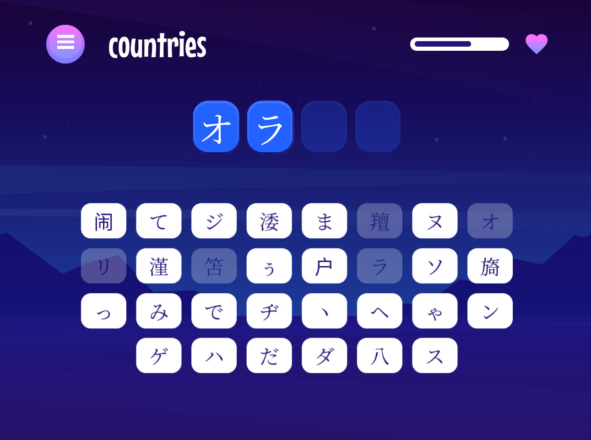

# Frontend Mentor - Hangman game solution

This is a solution to the [Hangman game challenge on Frontend Mentor](https://www.frontendmentor.io/challenges/hangman-game-rsQiSVLGWn). Frontend Mentor challenges help you improve your coding skills by building realistic projects.

## Table of contents

- [Overview](#overview)
  - [The challenge](#the-challenge)
  - [Screenshot](#screenshot)
  - [Links](#links)
- [My process](#my-process)
  - [Built with](#built-with)
  - [Continued development](#continued-development)
- [Author](#author)

## Overview

### The challenge

Users should be able to:

- Learn how to play Hangman from the main menu.
- Start a game and choose a category.
- Play Hangman with a random word selected from that category.
- See their current health decrease based on incorrect letter guesses.
- Win the game if they complete the whole word.
- Lose the game if they make eight wrong guesses.
- Pause the game and choose to continue, pick a new category, or quit.
- View the optimal layout for the interface depending on their device's screen size.
- See hover and focus states for all interactive elements on the page.
- Navigate the entire game only using their keyboard.

### Screenshot

### Links

- [Solution](https://github.com/kxrn0/fem_hangman)
- [Live](https://kxrn0.github.io/fem_hangman)

## My process

### Built with

- Semantic HTML5 markup
- CSS custom properties
- Flexbox
- [Typescript](https://www.typescriptlang.org/)
- [SolidJS™](https://www.solidjs.com/) - JS library

### Continued development

There are many bugs, but what I'd like to fix next is the back button, since using it to navigate back breaks the website.
I would also like to find a way to reset the history when the start component mounts without breaking the page.

## Author

- Frontend Mentor - [@kxrn0](https://www.frontendmentor.io/profile/kxrn0)
- Twitter - [@alhazred999](https://www.twitter.com/alhazred999)
